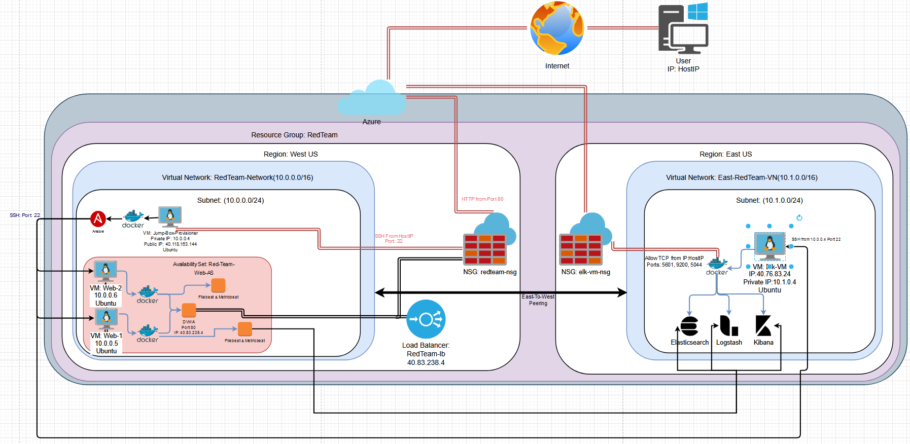

## Automated ELK Stack Deployment

The files in this repository were used to configure the network depicted below.

These files have been tested and used to generate a live ELK deployment on Azure. They can be used to either recreate the entire deployment pictured above. Alternatively, select portions of the _playbook file may be used to install only certain pieces of it, such as Filebeat.

- [install-elk.yml](Ansible/install-elk.yml)
- [filebeat-playbook.yml](Ansible/filebeat-playbook.yml)
- [metricbeat-playbook.yml](Ansible/metricbeat-playbook.yml)

This document contains the following details:

- Description of the Topology
- Access Policies
- ELK Configuration
  - Beats in Use
  - Machines Being Monitored
- How to Use the Ansible Build

### Description of the Topology

The main purpose of this network is to expose a load-balanced and monitored instance of DVWA, the D*mn Vulnerable Web Application.

Load balancing ensures that the application will be highly efficient. In addition to restricting access to the network, the load balancer protects availability by distributing traffic efficiently  across multiple severs to prevent one server from being overloaded. Even if one server goes down the load balancer will allow the server to keep running. Additionally our load balancer will protect against DDoS attacks.

The jump box is configured to allow traffic only from trusted sources, it is used to indirectly interact with the other machines on our network to reduce the risk of our credentials being exposed.

Integrating an ELK server allows users to easily monitor the vulnerable VMs for changes to the log files and system performance.

Filebeat can be used to collect log files and advents such as server logs. Metricbeat can be used to collect metrics such as uptime and CPU usage

The configuration details of each machine may be found below.

| Name                 | Function         | IP Address                         | Operating System |
|----------------------|------------------|------------------------------------|------------------|
| Jump-Box-Provisioner | Gateway          | 10.0.0.4, Public IP:40.118.163.144 | Linux            |
| web-1                | Web-server       | 10.0.0.5                           | Linux            |
| web-2                | Web-server       | 10.0.0.6                           | Linux            |
| Elk-VM               | Elk Stack Server | 10.1.0.4  Public IP:40.76.83.24    | Linux            |

### Access Policies

The machines on the internal network are not exposed to the public Internet. 

Only the Jump-Box-Provisioner can accept connections from the Internet. Access to this machine is only allowed from the following IP address:
	HostIP

Machines within the network can only be accessed by _the Jump-Box-Provisioner.
	The data from the Elk machine can be viewed from the HostIP however it can only be fully accessed from the Jump-Box-Provisioner 10.0.0.4

A summary of the access policies in place can be found in the table below.

| Name                 | Publicly Accessible | Allowed IP Addresses |
|----------------------|---------------------|----------------------|
| Jump-Box-Provisioner | Yes                 | HostIP               |
| web-1                | No                  | 10.0.0.4             |
| web-2                | No                  | 10.0.0.4             |
| Elk-VM               | No                  | 10.0.0.4, and HostIP |

### Elk Configuration

Ansible was used to automate configuration of the ELK machine. Since no configuration was performed manually, it can be deployed by IT again quickly and efficiently, saving lots of time that could be spent elsewhere.
The playbook implements the following tasks:
- ...Downloads and installs Docker
- ...Installs Python3-pip
- ...Ensures the correct amount of memory is used
- ...downloads and launches the elk container

The following screenshot displays the result of running `docker ps` after successfully configuring the ELK instance.

### Target Machines & Beats
This ELK server is configured to monitor the following machines: 
	web-1
	web-2

We have installed the following Beats on these machines:
	Filebeat
	Metricbeat

These Beats allow us to collect the following information from each machine:

Filebeat can be used to collect and centralize our log data such as 
Metricbeat can be used to collect metrics such as uptime and CPU usage.

### Using the Playbook
In order to use the playbook, you will need to have an Ansible control node already configured. Assuming you have such a control node provisioned: 

SSH into the control node and follow the steps below:
- Copy the configuration file to the Webserver.
- Update the /etc/ansible/hosts file to include the following
 [webservers]
 10.0.0.4 ansible_python_interpreter=/usr/bin/python3
 10.0.0.5 ansible_python_interpreter=/usr/bin/python3
 10.0.0.6 ansible_python_interpreter=/usr/bin/python3

 [elk]
 10.1.0.4 ansible_python_interpreter=/usr/bin/python3

- Run the playbook and navigate to the Elk server and run 'docker ps' to check that the installation worked as expected.
- [install-elk.yml](Ansible/install-elk.yml) is the playbook, copy it to '/etc/ansible/'
- Navigate to 'http://<ELK.VM.External.IP>:5601/app/kibana' in order to check that the ELK server is running.
